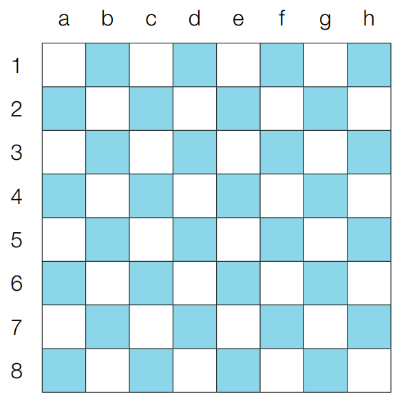

# 구현
- 피지컬 문제이다. (프로그래밍 문법 및 코드 작성 속도가 중요함)
- 대체로 사소한 조건 설정이 많은 문제이며 예를 들어서
  - 코드가 지나칠 만큼 길어지는 문제
  - 특정 소수점 자리까지 출력해야하는 문제
  - 문자열이 입력으로 주어졌을 때 파싱해야하는 문제 등
- 문제의 길이가 긴 편일 때 구현문제를 의심할 것

## 예제
### 예제 4-1 (상하좌우)
- 여행자가 N*N 정사각형 공간위에 서있다. (1<= N <= 100)
- 여행자는 계획서에 따라 움직인다. (1<= 총 이동횟수 <= 100)
  - L : 왼쪽으로 한칸 이동
  - R : 오른쪽으로 한칸 이동
  - U : 위로 한칸 이동
  - D : 아래로 한칸 이동
- 단, 정사각형 구역을 무시하려는 움직임은 무시된다.
- 출력: 이동을 모두 끝마쳤을 때 여행자가 위치한 좌표 (X, Y)를 공백으로 구분하여 출력한다.

```python
[입력예시]
5
R R R U D D
```
```python
[출력예시]
3 4
```

```python
n = int(input())
x, y = 1, 1
plans = input().split()  # 여행 계획서

# L, R, U, D 순
dx = [0, 0, -1, 1]
dy = [-1, 1, 0, 0]
move_types = ['L', 'R', 'U', 'D']

for plan in plans:
    # 이동할 좌표 반환
    for i in range(len(move_types)):
        if plan == move_types[i]:
            nx = x + dx[i]
            ny = y + dy[i]

    # 공간을 벗어난 경우 무시
    if nx < 1 or ny < 1 or nx > n or ny > n:
        continue

    x, y = nx, ny

print(x, y)
```

<br/>

### 예제 4-2 (시각)
- 00시00분00초부터 N시59분59초까지의 시각 중에서 `3`이 하나라도 포함되는 모든 경우의 수를 구하는 프로그램 작성 (0<=N<=23)
- 예를 들어 다음이 3이 하나라도 포함되어있는 시각이다.
  - 00시 00분 03초
  - 00시 13분 30초
- 하루는 총 86,400초 이므로 완전탐색을 통해 해결 가능

```python
[입력예시]
5
```
```python
[출력예시]
11475
```

```python
h = int(input())
count = 0

for i in range(h + 1):
    for j in range(60):
        for k in range(60):
            if '3' in str(i) + str(j) + str(k):
                count += 1

print(count)
```

<br/>

### 실전문제 2 (왕실의 나이트)
- 8*8 체스판이 주어진다.
- 특정 위치에 나이트가 주어졌을 때 이동할 수 있는 경우의 수를 출력하라
  - 두칸직진후 좌우로 한칸 더 이동한다.
- 위치좌표는 행(1~8), 열(a~h)로 표현한다.
- 

```python
[입력예시]
a1
```
```python
[출력예시]
2
```

```python
input_data = input()
row = int(input_data[1])
column = int(ord(input_data[0])) - int(ord('a')) + 1

steps = [(-2, -1), (-1, -2), (1, -2), (2, -1), (2, 1), (1, 2), (-1, 2), (-2, 1)]

result = 0
for step in steps:
    next_row = row + step[0]
    next_column = column + step[1]

    # 보드판 내에 위치할 수 있는 경우에 카운트
    if 1 <= next_row <= 8 and 1 <= next_column <= 8:
        result += 1

print(result)
```

<br/>

### 실전문제 3 (게임 개발)
- N*M 크기의 맵이 있다.
  - 각각의 칸은 육지 또는 바다이다. (바다는 갈 수 없다.)
- 캐릭터는 동서남북중 한 곳을 바라본다.
- 왼손 방향에 아직 가보지 않은 칸이 존재한다면 왼쪽방향으로 회전한 후 한칸 전진한다.
- 더 이상 갈 수 있는 칸이 없는 경우 한발 뒤로 물러선다.
  - 단, 뒤쪽 방향이 바다인 경우 움직임을 멈춘다. (탐험 종료)

- 입력
  - 맵의 가로세로 N,M 크기가 주어진다. (3<=N,M<=50)
  - 게임 캐릭터가 있는 칸의 좌표 (A, B)와 바라보는 방향 d가 공백으로 구분되어 주어진다.
    - 케릭터는 무조건 육지에서 시작한다.
  - 이후 맵에 대한 정보가 주어진다. (0=육지, 1=바다)
```python
[입력예시]
4 4
1 1 0
1 1 1 1
1 0 0 1
1 1 0 1
1 1 1 1
```
- 출력
  - 이동을 마친 후 캐릭터가 방문한 칸의 수를 출력한다.
```python
[출력예시]
3
```

