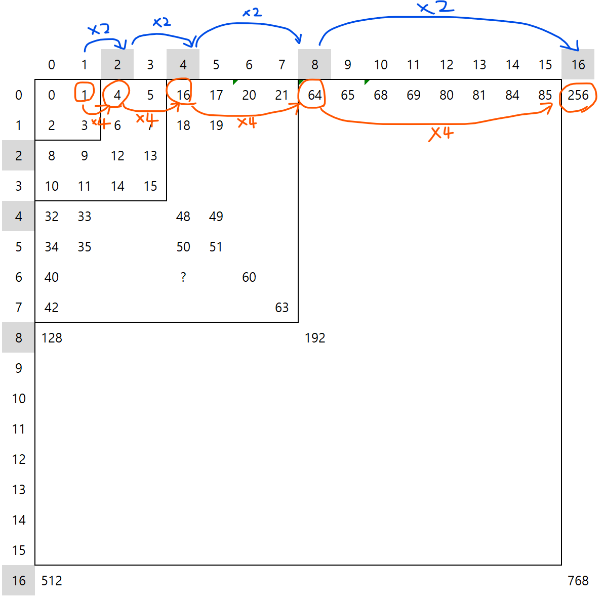
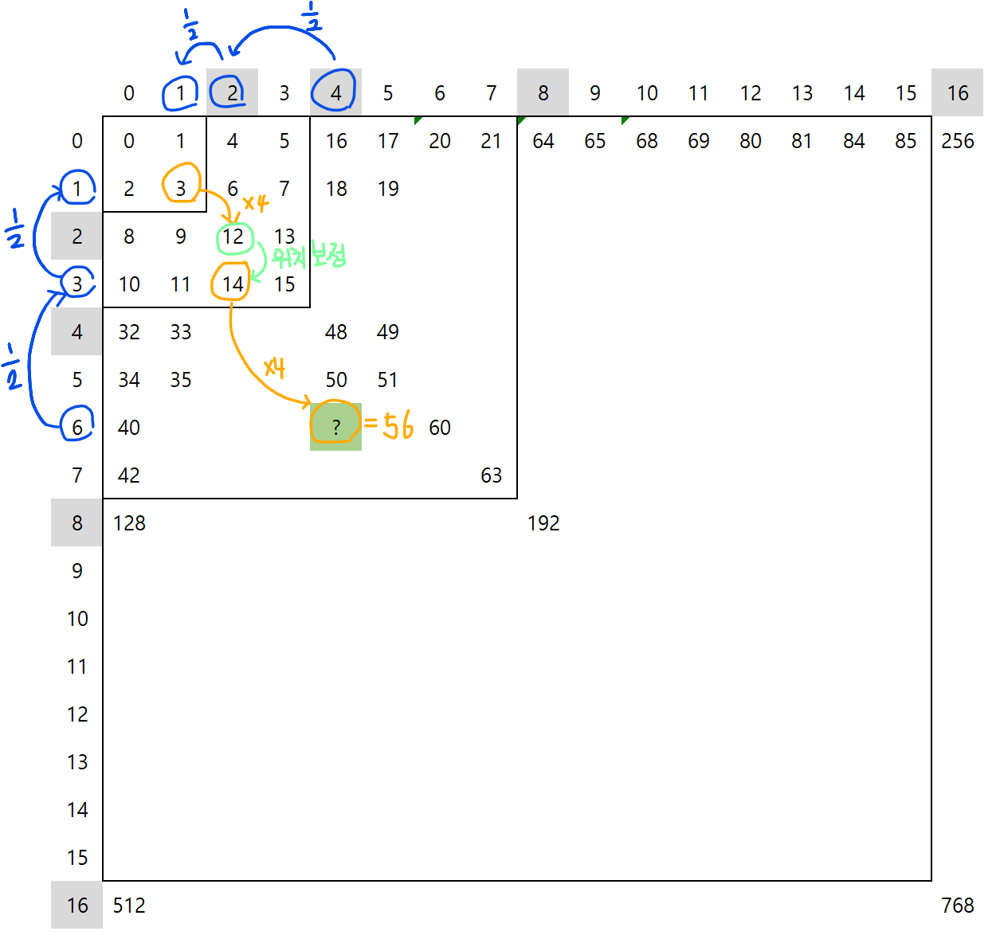

# 1074. Z
배열을 아래그림과 같이 Z모양으로 탐색한다. 배열을 재귀적으로 탐색할때 특정 행, 렬을 몇번째로 탐방하는지 반환해주면 된다.
> 입력 : 첫째 줄에 정수 N, r, c가 주어진다.
> 
> 출력 : r행 c열을 몇 번째로 방문했는지 출력한다.
> 

<br/>


> https://www.acmicpc.net/problem/1074
>
> 한수는 크기가 2N × 2N인 2차원 배열을 Z모양으로 탐색하려고 한다. 예를 들어, 2×2배열을 왼쪽 위칸, 오른쪽 위칸, 왼쪽 아래칸, 오른쪽 아래칸 순서대로 방문하면 Z모양이다.
>
> N > 1인 경우, 배열을 크기가 2N-1 × 2N-1로 4등분 한 후에 재귀적으로 순서대로 방문한다.
>
> N이 주어졌을 때, r행 c열을 몇 번째로 방문하는지 출력하는 프로그램을 작성하시오.

<br/>

## 입출력 예제

```
Input: 2 3 1
Output: 11
```
```
Input: 3 7 7
Output: 63
```
```
Input: 1 0 0
Output: 0
```
```
Input: 4 7 7
Output: 63
```
```
Input: 10 511 511
Output: 262143
```
```
Input: 10 512 512
Output: 786432
```

입력 범위 : 1 ≤ N ≤ 15,  0 ≤ r, c < 2N

<br/>


# 생각해 볼만한 사항
아래는 행렬 규칙의 일부를 표시한 것이다.

- 행 또는 열의 값이 2배 커질때마다, 방문순서는 4배만큼 커지게 된다.
- 행 또는 열의 값이 홀수인 경우 보정이 필요하다. (어떤수에 2를 곱하면 무조건 짝수가 나오기 때문)



<br/>

위와 같은 규칙을 통해 6, 4번에 탐색순서를 구해보면 아래와 같다.




