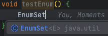

# ITEM 01
생성자 대신 정적 팩터리 메서드를 고려하라

## 정적 팩터리 메서드
- public 생성자 대신 정적 팩터리 메서드를 제공할 수 있다.
- 정적 팩터리 메서드와 public 생성자는 각자의 쓰임새가 있으니 상대적인 장단점을 이해하고 사용하는 것이 좋다.
- 그렇다고 하더라도 정적 팩터리를 사용하는게 유리한 경우가 더 많으므로 무작정 public 생성자를 제공하는 습관이 있었다면 고쳐야한다.

### Boolean 객체에서 사용되는 예
```java
public final class Boolean implements java.io.Serializable,
        Comparable<Boolean> {
    public static final Boolean TRUE = new Boolean(true);
    public static final Boolean FALSE = new Boolean(false);
    ...
    public static Boolean valueOf(boolean b) {
        return (b ? TRUE : FALSE);
    }
    ...
}
```

### 흔히 사용하는 명명방식
- 같은 타입을 반환하는 경우
  - from: 매개변수를 하나 받아서 해당 타입의 인스턴스를 반환하는 형변환 메서드
    - Date d = Date.from(instant);
  - of: 매개변수를 여러개 받아서 적합한 타입의 인스턴스를 반환하는 집계 메서드
    - Set<Rank> faceCards = EnumSet.of(JACK, QUEEN, KING);
  - valueOf: from과 of의 더 자세한 버전
    - BigInteger prime = BigInteger.valueOf(Integer.MAX_VALUE);
  - instance or getInstance: 매개변수로 명시한 인스턴스를 반환하지만 같은 인스턴스임을 보장하지 않는다. (보통 메모리에 올라가있는 인스턴스를 활용)
    - StackWalker luke = StackWalker.getInstance(classObject, arrayLen);
- 다른 타입을 반환 하는 경우
  - getType: getInstance와 같으나 생성할 클래스가 아닌 다른 클래스에 팩터리 메서드를 정의할 때 쓴다. 여기서 Type은 반환할 객체의 타입이다.
    - FileStore fs = Files.getFileStore(path);
  - newType: newInstance와 같으나 생성할 클래스가 아닌 다른 클래스에 팩터리 메서드를 정의할 때 쓴다. 여기서 Type은 반환할 객체의 타입이다.
    - BufferedReader br = Files.newBufferedReader(path);
  - type: getType과 newType의 간결한 버전
    - List<Complaint> litany = Collections.list(legacyLitancy);

## 장점
### 1. 이름을 가질 수 있다.
- 생성자에 넘기는 매개변수와 생성자 자체만으로는 반환될 객체의 특성을 제대로 설명하지 못함
- 정적 팩토리 메소드를 사용하고 이름을 잘 부여한다면 반환될 객체의 특성을 쉽게 묘사 가능
  - ex) BigInteger(int, int, Random) vs BigInteger.probablePrime
- 하나의 시그니처로는 생성자를 하나만 만들 수 있다. (매개변수의 순서를 다르게해서 해당 제한을 피할 순 있다.)
- 유사한 시그니처가 여러개 필요한 경우 정적팩터리를 이용하고, 각각의 차이를 잘 나타낼 수 있도록 이름을 부여하자
  - ex) Student(int, String) & Student(String, int) 대신
  - ex) Student.score("국어", 100) & Student.grade("출석", 3)

### 2. 호출될 때마다 인스턴스를 새로 생성하지는 않아도 된다.
- 미리 만들어둔 인스턴스를 활용하거나, 새로 생성한 인스턴스를 캐싱하여 재활용할 수 있다.
- 따라서 생성비용이 크거나 같은 객체가 자주 요청되는 상황에서 사용하기 용이하다.
- 플라이웨이트 패턴과  유사한 기법임
- 인스턴스 통제가 가능하다. (instance-controlled)
  - Singleton, noninstaniable 을 만들 수 있음
  - 불변 값 클래스에서 동치인 인스턴스가 단 하나뿐임을 보장할 수 있음
  - 플라이웨이트 패턴의 근간이 됨
  - 열거 타입이 인스턴스가 하나만 만들어짐을 보장

### 3. 반환 타입의 하위 타입 객체를 반환할 수 있는 능력이 있다.
- 구현 클래스 공개없이 해당 구현 객체를 반환할 수 있어 API를 작게 유지할 수 있음
- 인터페이스 기반 프레임워크(ITEM20)을 만드는 핵심 기술
```java
public class Bird {
    void quack() {
    }

    public static Bird duck() {
        return new Duck();
    }

    public static Bird chicken() {
        return new Chicken();
    }

//    public static Bird mouse() {
//        return new Mouse();
//    }
}
```

### 4. 입력 매개변수에 따라 매번 다른 클래스의 객체를 반환할 수 있다.
- 반환 타입의 하위 타입이기만 하면 어떤 클래스의 객체를 반환하든 상관없다. (위 장점 3과 이어짐)
- 예를 들어 EnumSet 클래스는 public 생성자 없이 오직 정적 팩터리만 제공하며
  - 원소가 64개 이하면 원소들을 long 변수 하나로 관리하는 RegulareEnumSet 인스턴스
  - 원소가 65개 이상이면 long 배열로 관리하는 JumboEnumSet 인스턴스를 반환함
  - https://www.nextree.co.kr/p11686/
  - 

```java
public static <E extends Enum<E>> EnumSet<E> noneOf(Class<E> elementType) {
    Enum<?>[] universe = getUniverse(elementType);
    if (universe == null)
        throw new ClassCastException(elementType + " not an enum");

    if (universe.length <= 64)
        return new RegularEnumSet<>(elementType, universe);
    else
        return new JumboEnumSet<>(elementType, universe);
}
```

- 클라이언트 입장에서는 이 두 클래스의 존재를 모름 (어떤 인스턴스인지 알 수도 알 필요도 없다.)

### 5. 정적 팩터리 메서드를 작성하는 시점에는 반환할 객체의 클래스가 존재하지 않아도 된다.
- 인터페이스만 존재하는 클래스도 반환이 가능함
- 실제 프로젝트 패키지안에 클래스가 존재하지 않을때, 런타임에서 위치를 명시하는 것으로 클래스를 반환할 수 있음
```java
public interface Food {
}

public class item01 {
  public static Food getFood() {
    return null;
  }
}
```

## 단점
### 1. 상속을 하려면 public이나 protected 생성자가 필요하니 정적 팩터리 메서드만 제공하면 하위 클래스를 만들 수 없다.
- 해당 제약은 상속보다 컴포지션(ITEM18) 사용을 유도하고, 불변타입(ITEM17)으로 만들려면 이 제약을 지켜야한다는 장점으로 받아들일 수도 있다.

### 2. 정적 팩터리 메서드는 프로그래머가 찾기 어렵다.
- 생성자처럼 API 설명에 명확히 드러나지 않으니 사용자는 정적 팩터리 메서드 방식 클래스를 인스턴스화할 방법을 알아내야함
- 인터페이스만 존재하는 Food를 
