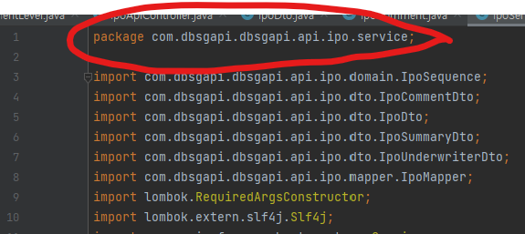

# 구글 자바 코드 스타일 (컨벤션)
- 관심있는 부분만 간추려서 정리합니다.
- 참고 원본 : https://google.github.io/styleguide/javaguide.html
- 참고 번역본 : https://newwisdom.tistory.com/m/96


# 소스 파일 공통 사항
## 공백 문자
- 문자열 및 문자 리터럴의 다른 모든 공백 문자는 이스케이프 됩니다.
- Tab은 들여쓰기에 사용되지 않습니다.
  - IDE에서 자동으로 띄어쓰기로 변환해주기도 하니 확인하여 사용

## ASCII가 아닌 문자
- 유니코드 문자를 사용하는 것을 권장하진 않지만, 코드를 더 쉽게 읽고 이해할 수 있게 만드는 경우라면 사용할 수 있다.
- 유니코드 문자 사용시 주석이 매우 유용할 것으로 예상됨
- 일부 프로그램이 ASCII가 아닌 문자를 제대로 처리하지 못할 수 있다는 두려움으로 코드 가독성을 낮추지 말것. (그러한 경우 프로그램을 수정해야함)

|예제|평가|설명|
|---|---|---|
|String unitAbbrev = "μs";|최고|주석이 없어도 이해할 수 있습니다.
|String unitAbbrev = "\u03bcs"; // "μs"|-|가능하지만 굳이 왜... 
|String unitAbbrev = "\u03bcs"; // Greek letter mu, "s"|-|가능하지만 어색하고 실수하기 쉽습니다. (그리스 문자 뮤)
|String unitAbbrev = "\u03bcs";|나쁨|다른 사람이 봤을 때 이해하기 어렵습니다.
|return '\ufeff' + content; // byte order mark|좋음|인쇄할 수 없는 문자에 이스케이프를 사용하고 주석을 추가합니다.

# 소스 파일 구조
소스 파일은 다음 순서로 구성됩니다.
1. 라이센스 또는 저작권 정보
2. Package 구문
3. Import 구문
4. 정확히 하나의 최상위 Class

## 1. 라이센스 또는 저작권 정보
- 라이센스 또는 저작권 정보가 있는 경우 기입합니다.
- 예시) MIT 라이센스 (https://github.com/git/git-scm.com/blob/main/MIT-LICENSE.txt)
```python
Copyright (c) 2012-2022 Scott Chacon and others

Permission is hereby granted, free of charge, to any person obtaining
a copy of this software and associated documentation files (the
"Software"), to deal in the Software without restriction, including
without limitation the rights to use, copy, modify, merge, publish,
distribute, sublicense, and/or sell copies of the Software, and to
permit persons to whom the Software is furnished to do so, subject to
the following conditions:

The above copyright notice and this permission notice shall be
included in all copies or substantial portions of the Software.

THE SOFTWARE IS PROVIDED "AS IS", WITHOUT WARRANTY OF ANY KIND,
EXPRESS OR IMPLIED, INCLUDING BUT NOT LIMITED TO THE WARRANTIES OF
MERCHANTABILITY, FITNESS FOR A PARTICULAR PURPOSE AND
NONINFRINGEMENT. IN NO EVENT SHALL THE AUTHORS OR COPYRIGHT HOLDERS BE
LIABLE FOR ANY CLAIM, DAMAGES OR OTHER LIABILITY, WHETHER IN AN ACTION
OF CONTRACT, TORT OR OTHERWISE, ARISING FROM, OUT OF OR IN CONNECTION
WITH THE SOFTWARE OR THE USE OR OTHER DEALINGS IN THE SOFTWARE.
```

## 2. Pacakge 구문
- 패키지 문은 줄바꿈 되지 않습니다.
- 패키지문이 들어간 라인은 글자수 제한이 없습니다.
- 예시: `package com.dbsgapi.dbsgapi.api.ipo.service;`


## 3. Import 구문
### 와일드 카드 금지
- 와일드카드 import를 사용하지 않습니다. (static인 경우도 포함)
  - 잘못 사용한 예시: `import java.util.*;` 
  - 와일드카드 `*` 를 사용함
### 개행하지 않음
- import 문은 줄바꿈 되지 않습니다.
- import문이 들어간 라인은 글자수 제한이 없습니다.
### import 작성 순서
- static import 들을 먼저 작성합니다.
- 이후 나머지 import 문을 작성합니다.
- static과 non-static import 사이에는 한줄을 띄웁니다.
- import문들은 ASCII 순으로 정렬합니다.
- 예시
```java
import static com.dbsgapi.dbsgapi.api.ipo.domain.CommentLevel.IPO_CANCEL;
import static com.dbsgapi.dbsgapi.api.ipo.domain.KindOfComment.*;

import java.io.IOException;
import java.util.ArrayList;
import java.util.List;
import java.util.Map;
import java.util.Objects;
```


## 4. 정확히 하나의 최상위 Class
### 클래스 구문 안에서 내용 순서
- Class 멤버 및 이니셜라이저 배치에 대한 규칙은 논리에 의해 스스로 생성하여 사용한다.
### 오버로드 구문들은 모아놓자
- 오버로딩 되는 메소드들은 한 곳에 모여잇어야하며, 그 사이에 다른 메소드가 존재해선 안된다.


# Formatting
## 중괄호를 꼭 쓰자
- if, else, for, do, while 을 사용할 때 body가 비어있어도 반드시 중괄호를 쓴다.
```java
if(true){}
while(true){
    break;
}
```
- 아래 두개 형태 모두 사용할 수 있음
```java
  // 허용
  void doNothing() {}

  // 허용
  void doNothingElse() {
  }
```
- 아래 경우에는 사용 할 수 없음
```java
  // 허용되지 않음 : 멀티 블럭 구문에서는 불가
  try {
    doSomething();
  } catch (Exception e) {}
```

## 중괄호가 한줄을 차지하지 않는다.
```java
return new MyClass() {
  @Override public void method() {
    if (condition()) {
      try {
        something();
      } catch (ProblemException e) {
        recover();
      }
    } else if (otherCondition()) {
      somethingElse();
    } else {
      lastThing();
    }
  }
};
```

## 인덴트 크기는 2칸
```java
public class A {
  int a = 0;
  if(a==1) {
    a = 0;
  }
}
```

## 한줄에는 100글자 까지만
- 한줄에는 100글자 까지만 존재할 수 있다.
- 한글처럼 폭이 큰 문자를 사용할 때는 규칙보다 먼저 줄바꿈을 하는 것도 시도해볼 수 있다.
- 예외
  - 주석내에 있는 URL 및 참조들
  - package 및 import 문

## 한 줄의 코드가 여러줄을 차지하는 방법
- 일반적으로 열 제한을 초과하지 않도록하는 것이 목표
- 줄바꿈을 하는 위치
  - 점 구분 기호 `.`
  - 메소드 참조 콜론 `::`
  - Type 바운드의 앰퍼샌드 `<T extends Foo & Bar`
  - catch 블록의 파이프 `catch(FooException)`


--> 4.6 부터 더 확인
