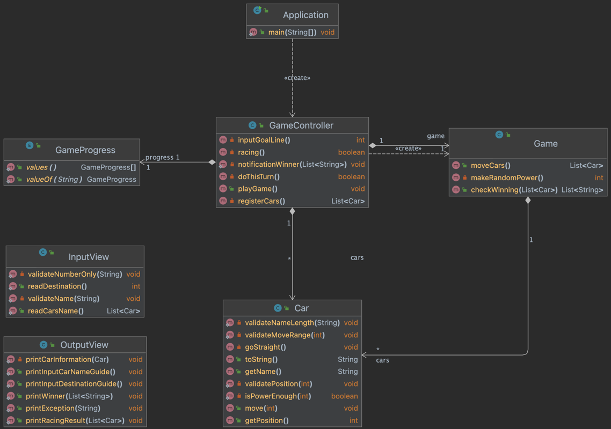

# 기능목록
- 클래스 다이어그램

## 입력 - InputView
- [x] 자동차 이름(출전자 명단)을 입력한다. - readCarsName
  - [x] 하나의 문자열로 쉼표(,)로 각 이름을 구분한다.
  - [x] 각각의 이름을 가진 자동차를 생성한다.
- [x] 몇 번 이동할건지(목적지까지의 거리)를 입력한다. - readDestination
  - [x] 숫자 형태로 변환한다.
  - [x] (e) 입력에 숫자 외에 형태가 있을 경우 예외 발생 - validateNumberOnly

## 자동차 - Car
- [x] 출전자 이름을 기억한다.
  - [x] (e) 이름이 5글자를 초과할시 예외 발생 - validateNameLength
- [x] 현재 위치를 기억한다.
  - [x] (e) 현재 위치가 0이하로 내려갈 경우 예외 발생 - validatePosition
- [x] 이동을 진행한다. - move
  - [x] 전달받은 값이 4이상인지 확인한다 - isPowerEnough
  - [x] 한칸 전진한다. - goStraight
  - [x] (e) 전달받은 값의 범위가 0~9 밖인 경우 예외 발생 - validateMoveRange

## 게임 진행자 - GameController
- [x] 참가자 명단을 받는다. - registerCars
- [x] 목적지까지의 거리를 받는다. - inputGoalLin
- [x] 레이싱을 진행한다. - racing
- [x] 우승자를 발표한다. - notificationWinner

## 게임 기능 - Game
- [x] 각 자동차가 전진한다. - moveCars
  - [x] 랜덤한 숫자를 생성한다. - makeRandomPower
- [x] 우승자가 나왔는지 확인한다. - checkWinning

## 출력 - OutputView
- [x] 자동차 이름 입력을 안내한다. - printInputCarNameGuide
- [x] 시도할 횟수 입력을 안내한다. - printInputDestinationGuide
- [x] 레이싱 실행 결과를 출력한다. - printRacingResult
- [x] 우승자 정보를 출력한다. - printWinner
- [x] 예외를 출력한다. - printException
