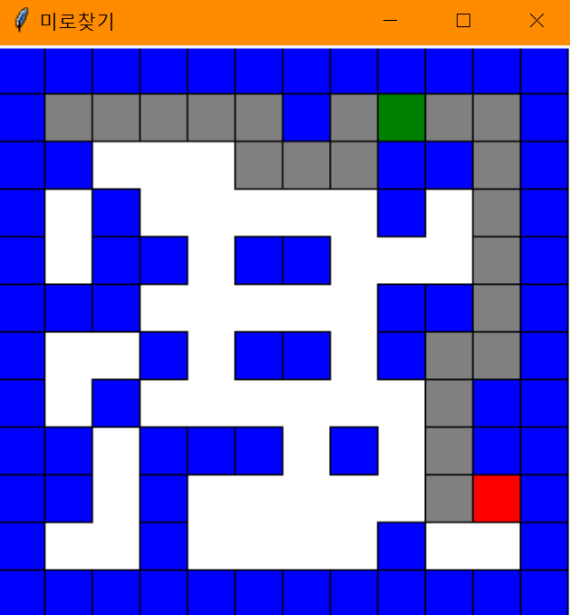
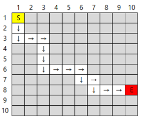

# 미로 생성 및 길찾기

## 환경
- Window
- tkinter
- python3

## 프로젝트 구조
- main.py : 통합
  - lib/animation.py : GUI 관련 기능
  - lib/maze.py : 미로 생성 기능
  - lib/pathfinding.py : 경로 찾기 기능

## 벽생성 메커니즘

- MAP 전체를 벽으로 초기화한다.
- 연속된 칸으로 n번만큼 이동하여 길을 만든다.
- 이후 전체 MAP을 확인하며 벽인경우 랜덤으로 길로 만든다.
- 고립된 구역이 발생하긴 하지만 무조건 도착지에 도달할 수 있음

## 길찾기 메커니즘
- DFS
  - 최초 탐색과정에서는 모든 경로를 보여주지만,
  - 이후 되돌아가는 과정에서는 DFS 경로상의 최적의 경로만 나타낸다.
