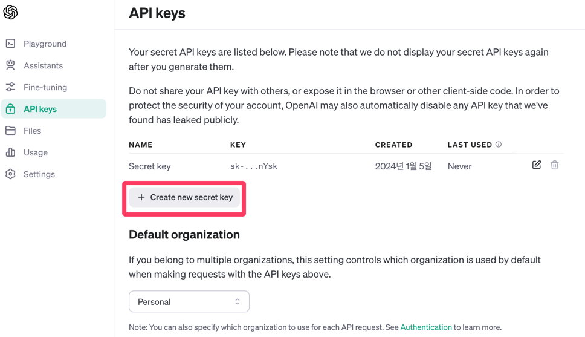

# OpenAI API 튜토리얼

## ChatGPT 처럼 사용
### Install the OpenAI Python library
Once you have Python 3.7.1 or newer installed and (optionally) a virtual environment setup, the OpenAI Python library can be installed. From the terminal / command line, run:

```shell
pip install --upgrade openai
```
Once this completes, running pip list will show you the Python libraries you have installed in your current environment, which should confirm that the OpenAI Python library was successfully installed.

<br/>

### Setup your API key for a single project
If you only want your API key to be accessible to a single project, you can create a local .env file which contains the API key and then explicitly use that API key with the Python code shown in the steps to come.

Start by going to the project folder you want to create the .env file in.

In order for your .env file to be ignored by version control, create a .gitignore file in the root of your project directory. Add a line with .env on it which will make sure your API key or other secrets are not accidentally shared via version control.
Once you create the .gitignore and .env files using the terminal or an integrated development environment (IDE), copy your secret API key and set it as the OPENAI_API_KEY in your .env file. If you haven't created a secret key yet, you can do so on the API key page.

The .env file should look like the following:

```python
# Once you add your API key below, make sure to not share it with anyone! The API key should remain private.
OPENAI_API_KEY=abc123
```

The API key can be imported by running the code below:
```python
from openai import OpenAI

client = OpenAI()
# defaults to getting the key using os.environ.get("OPENAI_API_KEY")
# if you saved the key under a different environment variable name, you can do something like:
# client = OpenAI(
#   api_key=os.environ.get("CUSTOM_ENV_NAME"),
# )
```

<br/>

### Get Your API Key

https://platform.openai.com/api-keys



<br/>

### Sending your first API request
After you have Python configured and an API key setup, the final step is to send a request to the OpenAI API using the Python library. To do this, create a file named openai-test.py using th terminal or an IDE.

Inside the file, copy and paste one of the examples below:

```python
from openai import OpenAI
client = OpenAI()

completion = client.chat.completions.create(
  model="gpt-3.5-turbo",
  messages=[
    {"role": "system", "content": "You are a poetic assistant, skilled in explaining complex programming concepts with creative flair."},
    {"role": "user", "content": "Compose a poem that explains the concept of recursion in programming."}
  ]
)

print(completion.choices[0].message)
```
To run the code, enter python openai-test.py into the terminal / command line.

The Chat Completions example highlights just one area of strength for our models: creative ability. Explaining recursion (the programming topic) in a well formatted poem is something both the best developers and best poets would struggle with. In this case, gpt-3.5-turbo does it effortlessly.

<br/>

### Run output
```shell
ChatCompletionMessage(content="In coding's realm, a dance of wonders,\nLies a concept that softly thunders.\nRecursion, a path both daring and bold,\nUnraveling logic, like stories of old.\n\nPicture a realm where echoes reside,\nA mirrored maze where time coincides.\nIt's a function that calls itself anew,\nA mystical loop, creating breakthroughs.\n\nA code's journey begins with a quest,\nA task to conquer, a mountain to crest.\nBut deep nested thoughts, tangled and vast,\nRequire a method to traverse the past.\n\nImagine a tale, a story unending,\nIts pages repeating, forever extending.\nThe hero, propelled with a self-crafted charm,\nSwoops through layers, with each mighty arm.\n\nLike a Russian doll, within dolls concealed,\nRecursion unwraps, dreams to reveal.\nWith each passing call, a step backward,\nTill a base case emerges, victory's lark.\n\nDelicate cycles, like a waltz's embrace,\nEliminating clutter, reducing the chase.\nThrough self-awareness, looping in kind,\nAn answer emerges, true and refined.\n\nYet heed the caution, amidst this rhyme,\nFor infinite loops lurk, a treacherous climb.\nEnsure a halt condition, a boundary reset,\nOr chaos may ensue, leaving logic in fret.\n\nRecursion, a magic potion, we find,\nUntangling enigmas, expanding the mind.\nSo let us embrace this mystical force,\nAnd embrace the endless, the profound, the source.", role='assistant', function_call=None, tool_calls=None)
```

<br/>
<br/>
<br/>

## PDF 파일 전달하기
https://platform.openai.com/docs/assistants/tools/uploading-files-for-retrieval

<br/>

### How it works
The model then decides when to retrieve content based on the user Messages. The Assistants API automatically chooses between two retrieval techniques:

it either passes the file content in the prompt for short documents, or
performs a vector search for longer documents
Retrieval currently optimizes for quality by adding all relevant content to the context of model calls. We plan to introduce other retrieval strategies to enable developers to choose a different tradeoff between retrieval quality and model usage cost.

<br/>

### 지원하는 확장자 목록
.c text/x-c .cpp text/x-c++ .csv application/csv .docx application/vnd.openxmlformats-officedocument.wordprocessingml.document .html text/html .java text/x-java .json application/json .md text/markdown .pdf application/pdf .php text/x-php .pptx application/vnd.openxmlformats-officedocument.presentationml.presentation .py text/x-python .py text/x-script.python .rb text/x-ruby .tex text/x-tex .txt text/plain .css text/css .jpeg image/jpeg .jpg image/jpeg .js text/javascript .gif image/gif .png image/png .tar application/x-tar .ts application/typescript .xlsx application/vnd.openxmlformats-officedocument.spreadsheetml.sheet .xml application/xml or text/xml .zip application/zip

<br/>

### Enabling Retrieval
Pass the retrieval in the tools parameter of the Assistant to enable Retrieval:
```python
assistant = client.beta.assistants.create(
  instructions="You are a customer support chatbot. Use your knowledge base to best respond to customer queries.",
  model="gpt-4-1106-preview",
  tools=[{"type": "retrieval"}]
)
```
If you enable retrieval for a specific Assistant, all the files attached will be automatically indexed and you will be charged the $0.20/GB per assistant per day. You can enabled/disable retrieval by using the Modify Assistant endpoint.

<br/>

### Uploading files for retrieval
Similar to Code Interpreter, files can be passed at the Assistant-level or individual Message-level.

```python
# Upload a file with an "assistants" purpose
file = client.files.create(
  file=open("knowledge.pdf", "rb"),
  purpose='assistants'
)

# Add the file to the assistant
assistant = client.beta.assistants.create(
  instructions="You are a customer support chatbot. Use your knowledge base to best respond to customer queries.",
  model="gpt-4-1106-preview",
  tools=[{"type": "retrieval"}],
  file_ids=[file.id]
)
```

When a file is attached at the Message-level, it is only accessible within the specific Thread the Message is attached to. After having uploaded a file, you can pass the ID of this File when creating the Message. Note that you are not charged based on the size of the files you upload via the Files API but rather based on which files you attach to a specific Assistant or Message that get indexed.

```python
message = client.beta.threads.messages.create(
  thread_id=thread.id,
  role="user",
  content="I can not find in the PDF manual how to turn off this device.",
  file_ids=[file.id]
)
```
The maximum file size is 512 MB and no more than 2,000,000 tokens (computed automatically when you attach a file). Retrieval supports a variety of file formats including .pdf, .md, .docx and many more. More details on the file extensions (and their corresponding MIME-types) supported can be found in the Supported files section below.

<br/>

### Retrieval pricing
Retrieval is priced at $0.20/GB per assistant per day. Attaching a single file ID to multiple assistants will incur the per assistant per day charge when the retrieval tool is enabled. For example, if you attach the same 1 GB file to two different Assistants with the retrieval tool enabled (e.g., customer-facing Assistant #1 and internal employee Assistant #2), you’ll be charged twice for this storage fee (2 * $0.20 per day). This fee does not vary with the number of end users and threads retrieving knowledge from a given assistant.

In addition, files attached to messages are charged on a per-assistant basis if the messages are part of a run where the retrieval tool is enabled. For example, running an assistant with retrieval enabled on a thread with 10 messages each with 1 unique file (10 total unique files) will incur a per-GB per-day charge on all 10 files (in addition to any files attached to the assistant itself).

-> 한 파일당 $0.2 부과 및 1GB 초과시마다 $0.2 추가 부과

<br/>

### Deleting files
To remove a file from the assistant, you can detach the file from the assistant:
```python
file_deletion_status = client.beta.assistants.files.delete(
  assistant_id=assistant.id,
  file_id=file.id
)
```
Detaching the file from the assistant removes the file from the retrieval index and means you will no longer be charged for the storage of the indexed file.


<br/>
<br/>
<br/>

## 기타
### 사용할 수 있는 토큰이 없는 경우
openai.RateLimitError: Error code: 429 - {'error': {'message': 'You exceeded your current quota, please check your plan and billing details. For more information on this error, read the docs: https://platform.openai.com/docs/guides/error-codes/api-errors.', 'type': 'insufficient_quota', 'param': None, 'code': 'insufficient_quota'}}

할당량을 모두 소진하였거나, 사용가능한 무료 토큰이 없는 경우 오류 발생

<br/>

### 무료 제공 토큰
2024년 1월 5일 기준 5달러


<br/>

### 예상 토큰 크기
https://platform.openai.com/tokenizer

openai에서 API요청시 토큰의 개념을 사용하는데, 그 제한 수가 넘어가면 에러가 발생합니다.(chatGPT3.5 4097, chatGPT4.0 8096)
출처: https://pagichacha.tistory.com/154 [파기차차:티스토리]

### 참고 자료

https://platform.openai.com/docs/quickstart?context=python