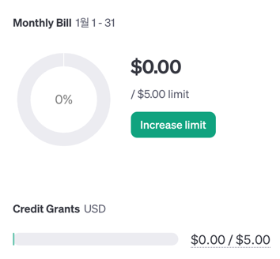

# OpenAI API 튜토리얼

## 순서
### Install the OpenAI Python library
Once you have Python 3.7.1 or newer installed and (optionally) a virtual environment setup, the OpenAI Python library can be installed. From the terminal / command line, run:

```shell
pip install --upgrade openai
```
Once this completes, running pip list will show you the Python libraries you have installed in your current environment, which should confirm that the OpenAI Python library was successfully installed.

<br/>

### Setup your API key for a single project
If you only want your API key to be accessible to a single project, you can create a local .env file which contains the API key and then explicitly use that API key with the Python code shown in the steps to come.

Start by going to the project folder you want to create the .env file in.

In order for your .env file to be ignored by version control, create a .gitignore file in the root of your project directory. Add a line with .env on it which will make sure your API key or other secrets are not accidentally shared via version control.
Once you create the .gitignore and .env files using the terminal or an integrated development environment (IDE), copy your secret API key and set it as the OPENAI_API_KEY in your .env file. If you haven't created a secret key yet, you can do so on the API key page.

The .env file should look like the following:

```python
# Once you add your API key below, make sure to not share it with anyone! The API key should remain private.
OPENAI_API_KEY=abc123
```

The API key can be imported by running the code below:
```python
from openai import OpenAI

client = OpenAI()
# defaults to getting the key using os.environ.get("OPENAI_API_KEY")
# if you saved the key under a different environment variable name, you can do something like:
# client = OpenAI(
#   api_key=os.environ.get("CUSTOM_ENV_NAME"),
# )
```

<br/>

### Get Your API Key

https://platform.openai.com/api-keys


<br/>

### Sending your first API request
After you have Python configured and an API key setup, the final step is to send a request to the OpenAI API using the Python library. To do this, create a file named openai-test.py using th terminal or an IDE.

Inside the file, copy and paste one of the examples below:

```python
from openai import OpenAI
client = OpenAI()

completion = client.chat.completions.create(
  model="gpt-3.5-turbo",
  messages=[
    {"role": "system", "content": "You are a poetic assistant, skilled in explaining complex programming concepts with creative flair."},
    {"role": "user", "content": "Compose a poem that explains the concept of recursion in programming."}
  ]
)

print(completion.choices[0].message)
```
To run the code, enter python openai-test.py into the terminal / command line.

The Chat Completions example highlights just one area of strength for our models: creative ability. Explaining recursion (the programming topic) in a well formatted poem is something both the best developers and best poets would struggle with. In this case, gpt-3.5-turbo does it effortlessly.

<br/>

### Run output
```shell
ChatCompletionMessage(content="In coding's realm, a dance of wonders,\nLies a concept that softly thunders.\nRecursion, a path both daring and bold,\nUnraveling logic, like stories of old.\n\nPicture a realm where echoes reside,\nA mirrored maze where time coincides.\nIt's a function that calls itself anew,\nA mystical loop, creating breakthroughs.\n\nA code's journey begins with a quest,\nA task to conquer, a mountain to crest.\nBut deep nested thoughts, tangled and vast,\nRequire a method to traverse the past.\n\nImagine a tale, a story unending,\nIts pages repeating, forever extending.\nThe hero, propelled with a self-crafted charm,\nSwoops through layers, with each mighty arm.\n\nLike a Russian doll, within dolls concealed,\nRecursion unwraps, dreams to reveal.\nWith each passing call, a step backward,\nTill a base case emerges, victory's lark.\n\nDelicate cycles, like a waltz's embrace,\nEliminating clutter, reducing the chase.\nThrough self-awareness, looping in kind,\nAn answer emerges, true and refined.\n\nYet heed the caution, amidst this rhyme,\nFor infinite loops lurk, a treacherous climb.\nEnsure a halt condition, a boundary reset,\nOr chaos may ensue, leaving logic in fret.\n\nRecursion, a magic potion, we find,\nUntangling enigmas, expanding the mind.\nSo let us embrace this mystical force,\nAnd embrace the endless, the profound, the source.", role='assistant', function_call=None, tool_calls=None)
```

<br/>
<br/>
<br/>

## 기타
### 사용할 수 있는 토큰이 없는 경우
openai.RateLimitError: Error code: 429 - {'error': {'message': 'You exceeded your current quota, please check your plan and billing details. For more information on this error, read the docs: https://platform.openai.com/docs/guides/error-codes/api-errors.', 'type': 'insufficient_quota', 'param': None, 'code': 'insufficient_quota'}}

할당량을 모두 소진하였거나, 사용가능한 무료 토큰이 없는 경우 오류 발생

<br/>

### 무료 제공 토큰
2024년 1월 5일 기준 5달러



<br/>

### 참고 자료

https://platform.openai.com/docs/quickstart?context=python